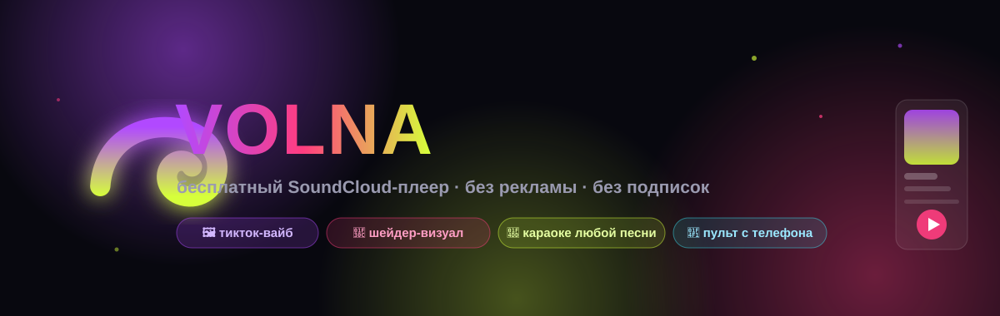
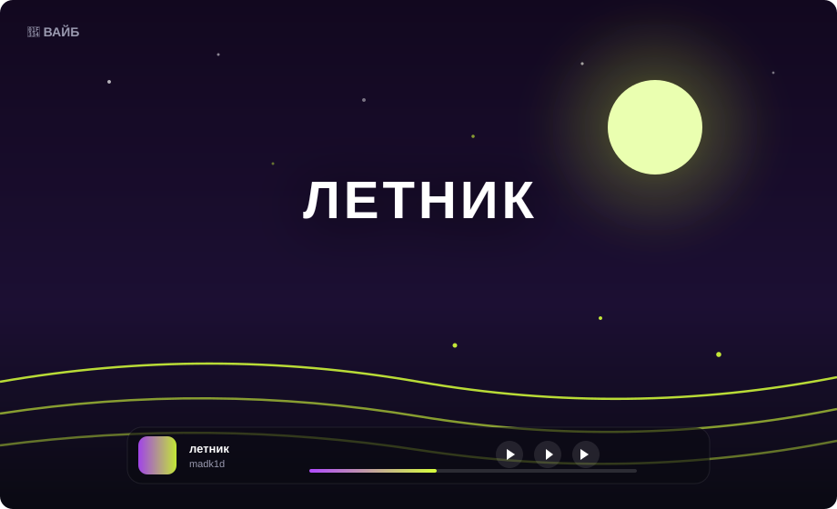
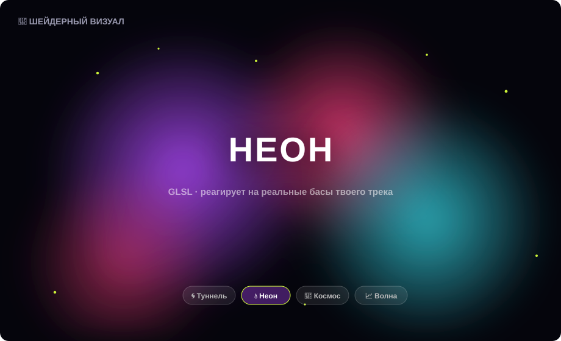
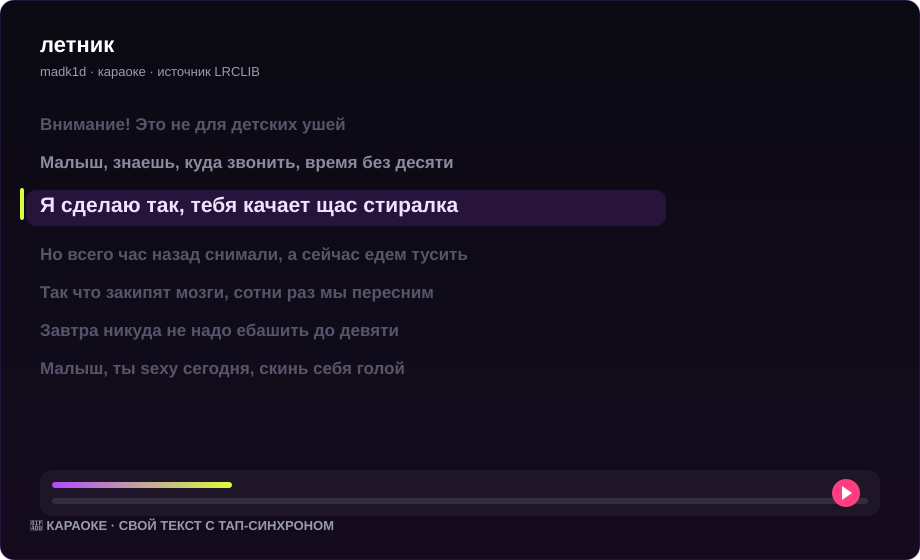

# 🌊 VOLNA

<div align="center">



[](https://github.com/ResokaU/volna/releases/latest)
[](LICENSE)
[](https://github.com/ResokaU/volna/releases/latest)
[](https://resokau.github.io/volna/donate)

**Скачай в [Releases](https://github.com/ResokaU/volna/releases/latest) — установка или портативная, без рекламы и подписок**

</div>

---

## 🖼 Это выглядит так

| 🌴 Вайб (тикток-режим) | 🌌 Шейдерный визуал |
|---|---|
|  |  |

| 📝 Караоке любой песни | |
|---|---|
|  | **Своя музыка — свой визуал.** Волновая перемотка, тап-синхрон текста, 10-полосный EQ, пульт с телефона — всё внутри. |

## ⚡ Возможности

### 🎧 Музыка
- Нативный аудио-движок: прямой mp3-поток через публичный API SoundCloud (виджет — фолбэк)
- Поиск: треки / артисты / плейлисты · открытие любых ссылок SoundCloud
- Вставь ссылку — PLAY. Мировые чарты и русские табы трендов
- Radio по похожим трекам, «Мне повезёт», скорость 0.5–2×, кроссфейд очереди

### 📝 Караоке
- Синхронизированный текст через LRCLIB + финальная фаза «только по названию»
- **✍️ Тап-синхрон**: свой текст для любых треков (своих!), сохраняется навсегда
- Подсветка строки, клик = seek, подгонка ±0.5с

### 🌴 Вайб и визуал
- Атмосферные фоны 1920p+ (6 категорий: аниме / ночь / лес / горы / город / природа / неон)
- **GLSL-шейдеры** под реальный FFT: Туннель · Неон · Космос · Волна
- Пылинки и пульсация от баса, Ken Burns-зум

### ❤️ Библиотека
- Лайки (локальные + сервер SoundCloud), умный фильтр
- Плейлисты: мозаика обложек, drag&drop, **экспорт/импорт файлом**, отмена удаления
- Очередь с голосованием с телефона (пульт по LAN)
- «Продолжить где остановился»

### 🎮 Пульт и соц
- 📱 **Пульт с телефона** по Wi-Fi: QR-код, пауза/треки/громкость/лайк
- 🎭 **Discord Rich Presence** с обложкой и кнопкой
- 🖼 Шаринг-карточки трека в буфер обмена

### 🛡 Антиблок
- DoH + ECH, прокси (socks5/http) **только для SoundCloud** — системный zapret не трогается
- Диагностика доступности хостов

### ⚙️ Ещё
- 18 акцентов (включая тёмные), масштаб UI, обои, кастомный курсор
- Тёмные инпуты, автообновления, честная статистика и heatmap
- 🥚 Пасхалки. Какие — не скажем.

## 🚀 Установка

```bash
# скачай VOLNA-Setup (установщик) или VOLNA-Portable (без установки)
# из https://github.com/ResokaU/volna/releases/latest
```

```bash
git clone https://github.com/ResokaU/volna && cd volna
npm install && npm start
```

## 💜 Поддержать

Серверы, разработка и кофейные волны — [**resokau.github.io/volna/donate**](https://resokau.github.io/volna/donate)

## 🧠 Как работает поиск

`api.soundcloud.com` мёртв (403), поэтому VOLNA ходит через **api-v2** — то же публичное API, что использует сам сайт: `client_id` добывается из JS-бандлов и кэшируется, запросы идут через IPC-прокси (net.fetch), воспроизведение — через официальный Widget или прямой progressive-поток.

## License

MIT — смотри [LICENSE](LICENSE). SoundCloud — их контент и их правила; VOLNA лишь красивое окно.
