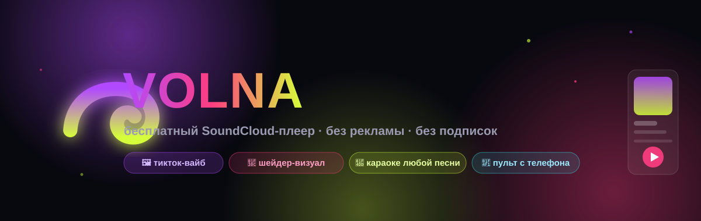
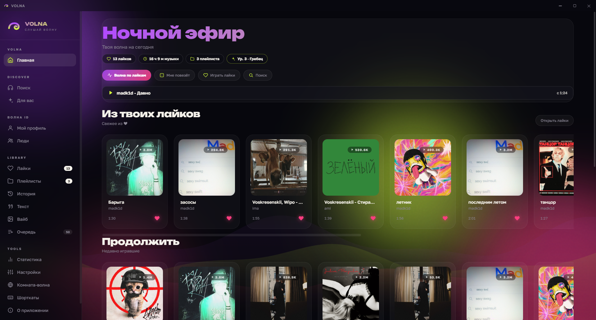
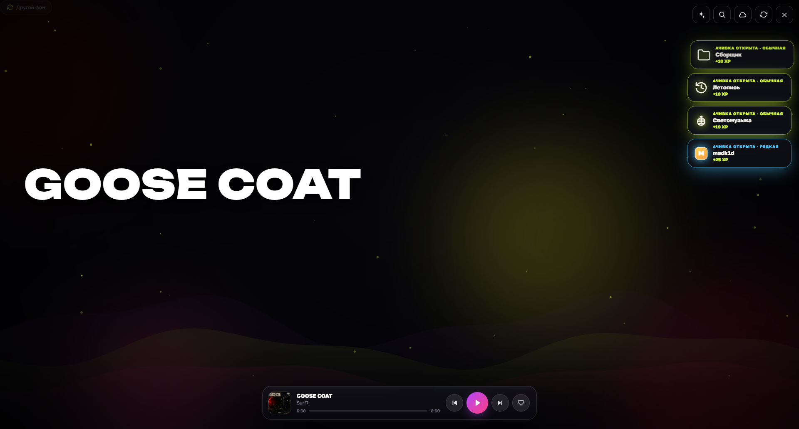
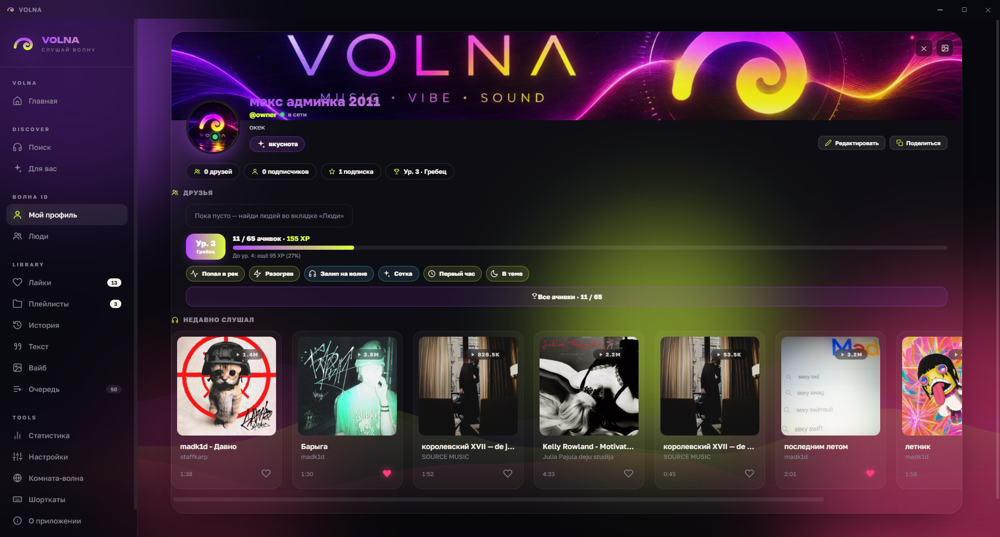
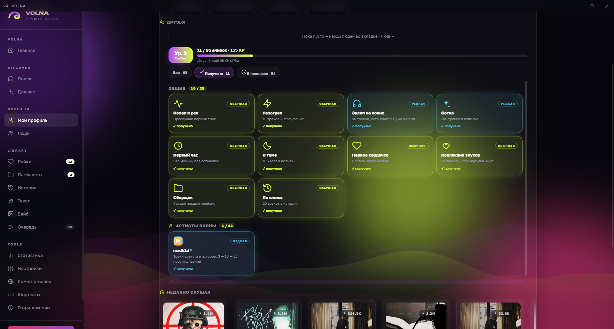
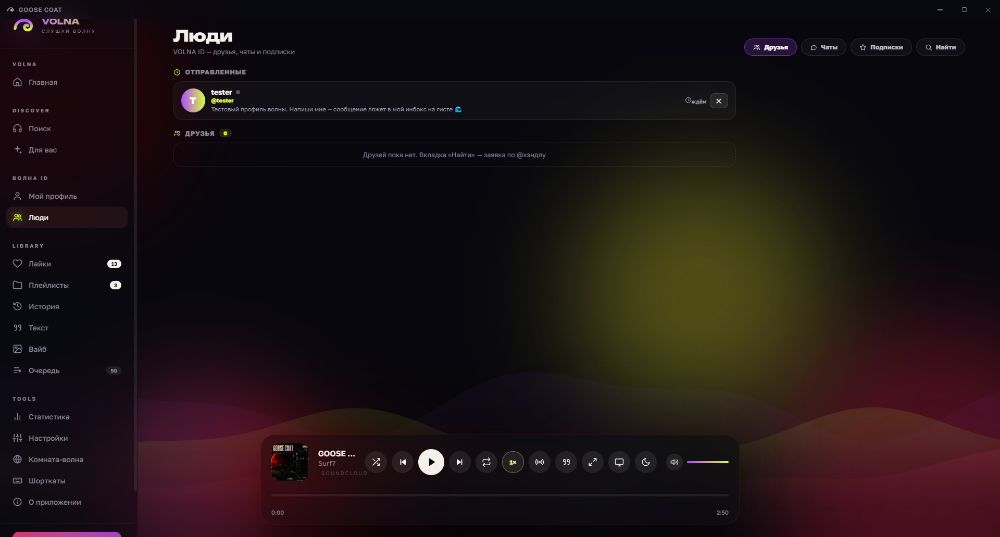
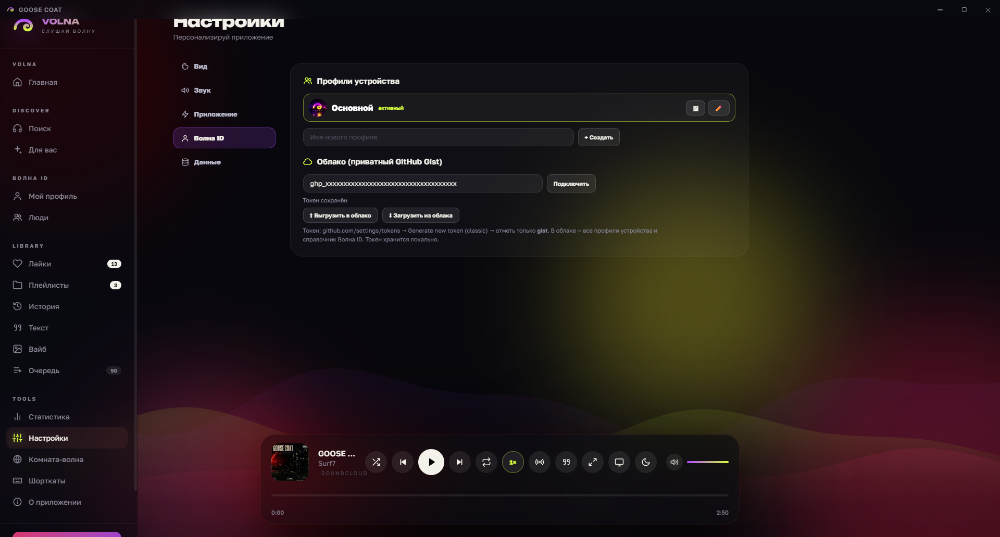

# 🌊 VOLNA

<div align="center">



[](https://github.com/ResokaU/volna/releases/latest)
[](LICENSE)
[](https://github.com/ResokaU/volna/releases/latest)
[](https://resokau.github.io/volna/donate)

**Не просто плеер — своя волна.** Звук SoundCloud, MilkDrop-визуалы, собственная соцсеть с профилями, друзьями и чатами, ачивки с огоньками — всё в одном красивом окне. Без рекламы и подписок.

**[⬇ Скачать VOLNA-Setup](https://github.com/ResokaU/volna/releases/latest)** · [портативная](https://github.com/ResokaU/volna/releases/latest) · [💜 поддержать](https://resokau.github.io/volna/donate)

</div>

---

## 🖼 Это выглядит так

| 🌙 Главная — твоя волна на сегодня | 🎆 Вайб — MilkDrop-режим |
|---|---|
|  |  |

| 🪪 Волна ID — свой профиль | 🏆 Ачивки с SVG-бейджами |
|---|---|
|  |  |

| 👥 Люди — друзья и чаты | ⚙ Настройки со своим сайдбаром |
|---|---|
|  |  |

## ⚡ Возможности

### 🎧 Музыка
- Нативный аудио-движок: прямой mp3-поток через публичный API SoundCloud (виджет — фолбэк)
- Поиск: треки / артисты / плейлисты · открытие любых ссылок SoundCloud
- Вставь ссылку — PLAY. Мировые чарты и русские табы трендов
- Radio по похожим трекам, «Мне повезёт», скорость 0.5–2×, кроссфейд очереди
- 10-полосный EQ, ночной компрессор, sleep timer, мини-плеер, пульт с телефона

### 🎆 Вайб
- **MilkDrop-движок** (butterchurn, сотни пресетов) + собственный GLSL-движок с фидбэком: Туннель · Неон · Космос · Волна
- Пылинки и пульсация от баса, атмосферные фоны 1920p+ (7 категорий)
- Полноэкранный тикток-режим с горячей полкой плеера

### 🪪 Волна ID — соцсеть внутри
- Свой профиль: баннер (своя картинка или обложка трека), аватар, био, статус, живой «Слушает: …»
- **Регистрация с паролем** (SHA-256 хэш, вход с любого ПК)
- Друзья, заявки, подписки, подписчики, личные чаты с офлайн-доставкой
- Присутствие в сети в реальном времени — всё без единого сервера (GitHub-облако + MQTT)
- Свой хост подключается адаптером одной строкой — [docs/volna-id.md](docs/volna-id.md)

### 🏆 Ачивки в культуре тиктока
- **57 ачивок**: «Попал в рек», «Залип на волне», «Форсишь», «Легенда флоу»…
- **🔥 Огонёк 3 и Огонёк недели** — не теряй серию дней, как в тиктоке
- **Тренды тиктока 2026**: Яра Яра, Она безумна, Phonk Chiki, Will Carry On
- У каждой ачивки свой SVG-значок: у артистов — генерированные бейджи (градиент + монограмма + мотив), у треков — винил
- XP-уровни с титулами: от «Слышащего» до «Мифа волны», редкости с конфетти

### 🌊 Комнаты-волны
- Слушай трек синхронно с друзьями через интернет — код комнаты, голосование за следующий трек
- Работает поверх MQTT, свой сервер не нужен

### ❤️ Библиотека
- Лайки (локальные + сервер SoundCloud), плейлисты с мозаикой, drag&drop, экспорт/импорт файлом
- Очередь с голосованием, «Продолжить где остановился»

### 📝 Караоке
- Синхронизированный текст через LRCLIB + финальная фаза «только по названию»
- **✍️ Тап-синхрон**: свой текст для любых треков, сохраняется навсегда

### 🎮 Пульт и соц
- 📱 **Пульт с телефона** по Wi-Fi: QR-код, пауза/треки/громкость/лайк
- 🎭 **Discord Rich Presence** с обложкой и кнопкой
- 🖼 Шаринг-карточки трека в буфер обмена

### ☁️ Облако
- Все профили устройства живут в приватном GitHub-гисте: **автосинк** после каждого изменения
- Восстановление на новом ПК в один клик

### 🛡 Антиблок
- DoH + ECH, прокси (socks5/http) **только для SoundCloud** — системный zapret не трогается
- Диагностика доступности хостов

### ⚙️ Ещё
- 18 акцентов (включая тёмные), масштаб UI, обои, кастомный курсор
- Настройки со своим сайдбаром: Вид · Звук · Приложение · Волна ID · Данные
- 🥚 Пасхалки. Какие — не скажем.

## 🚀 Установка

```bash
# скачай VOLNA-Setup (установщик) или VOLNA-Portable (без установки)
# из https://github.com/ResokaU/volna/releases/latest
```

```bash
git clone https://github.com/ResokaU/volna && cd volna
npm install && npm start
```

## 💜 Поддержать

Серверы, разработка и кофейные волны — [**resokau.github.io/volna/donate**](https://resokau.github.io/volna/donate)

## 🧠 Как работает поиск

`api.soundcloud.com` мёртв (403), поэтому VOLNA ходит через **api-v2** — то же публичное API, что использует сам сайт: `client_id` добывается из JS-бандлов и кэшируется, запросы идут через IPC-прокси (net.fetch), воспроизведение — через официальный Widget или прямой progressive-поток.

## License

MIT — смотри [LICENSE](LICENSE). SoundCloud — их контент и их правила; VOLNA лишь красивое окно.
